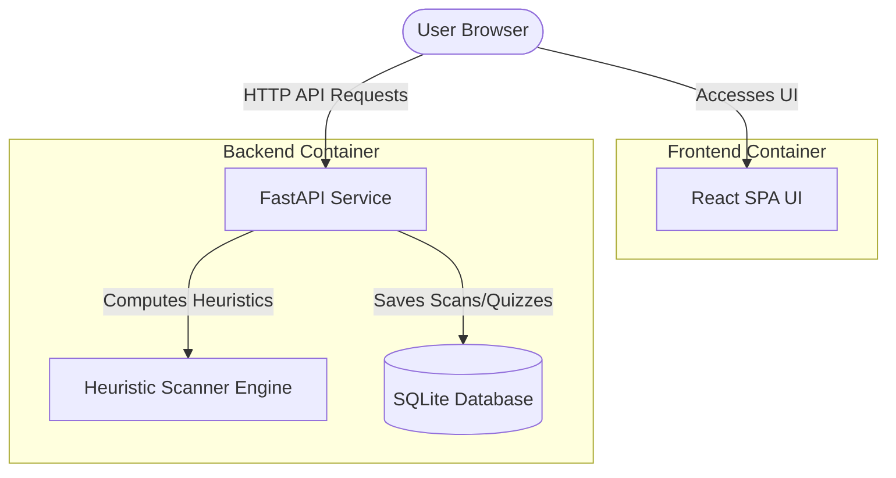
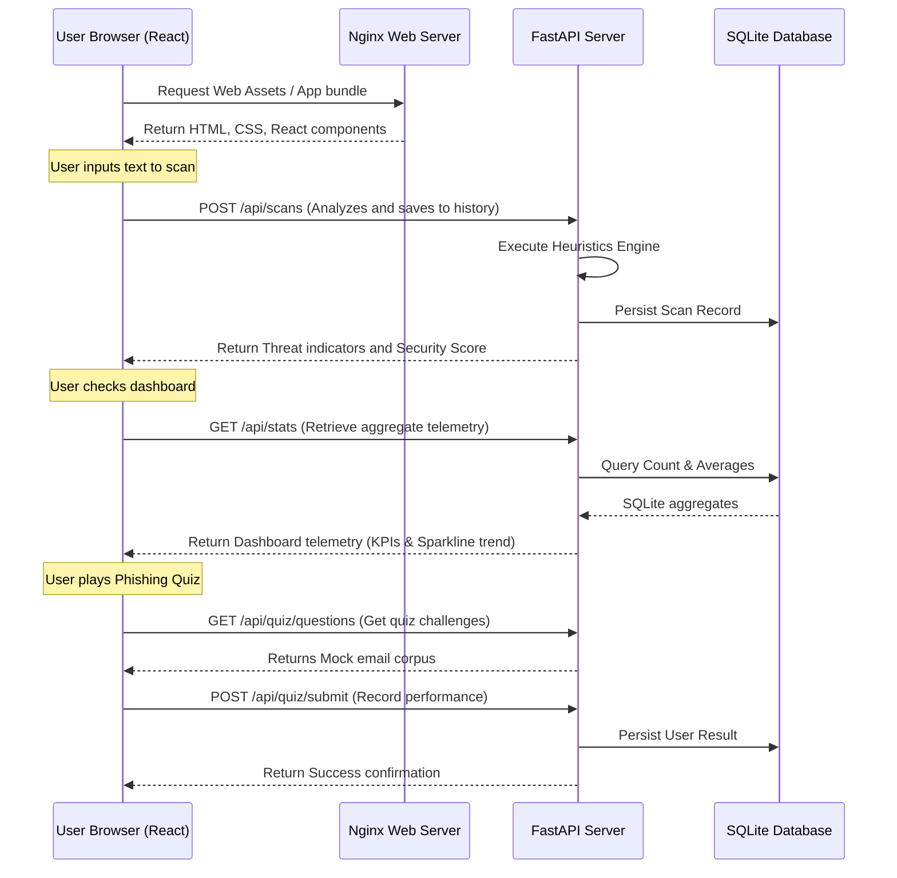

# DPhish — Cyber Threat & Phishing Intelligence Platform

DPhish is a secure awareness training platform and threat heuristics analyzer. It provides a beautiful interface (Security Dashboard) containing telemetry charts, a real-time email heuristics threat analyzer, phishing quizzes, and educational resources. 

The application is split into a **Python FastAPI backend** and a **React (Vite + TypeScript) frontend**, fully containerized using Docker and orchestrated using Docker Compose.

---

## 🏗️ Architecture & Stack



### Key Technologies
*   **Frontend**: React 18, Vite, TypeScript, Nginx (for production container runtime).
*   **Backend**: Python 3.11, FastAPI, SQLAlchemy, SQLite (for zero-configuration database storage).
*   **Deployment**: Multi-stage Docker builds, Docker Compose.

---

## 📂 Project Structure

```text
Dphish/
├── docker-compose.yml          # Root multi-container composer layout
├── README.md                   # Core project documentation (this file)
├── backend/                    # Python FastAPI Backend
│   ├── app/                    # Application source code
│   │   ├── database.py         # DB connection & Session builder
│   │   ├── models.py           # SQLAlchemy schemas (ScanHistory, QuizResult)
│   │   ├── schemas.py          # Pydantic data validation contracts
│   │   ├── heuristics.py       # Phishing email heuristics rules engine
│   │   ├── crud.py             # Database CRUD helper functions
│   │   └── main.py             # FastAPI entrypoint, routes, startup pre-seed
│   ├── Dockerfile              # Multi-stage python-slim runtime builder
│   └── requirements.txt        # Backend dependencies
└── task1_react_app/            # React Vite Frontend
    ├── src/                    # React components and code
    │   ├── components/         # UI Components (Dashboard, Analyzer, Quiz)
    │   ├── utils/              # Security scan engine (fallback rules)
    │   ├── App.tsx             # Main layout, routing, API synchronizers
    │   └── main.tsx            # DOM mounting entrypoint
    ├── Dockerfile              # Production multi-stage Nginx builder
    ├── nginx.conf              # SPA-compliant Nginx routing reverse proxy
    └── package.json            # NPM scripts & dependencies
```

---

## ⚙️ How the Application Works

The **DPhish** security platform is built as a microservices architecture that coordinates threat scanning, interactive user education, and telemetry visualization.



### Core Components

1.  **Frontend Single Page Application (React + Vite + TypeScript)**:
    *   **Interactive Scanner**: Submits raw email content or URLs to the backend engine to analyze risk.
    *   **Telemetry Dashboard**: Queries statistics dynamically to compute aggregate threat frequencies, security level gauges, and sparkline progress trends.
    *   **Security Quiz**: Interactive, gamified scenario-based phishing emails. It lets users analyze fake and legitimate headers/links to learn threat vectors.
2.  **FastAPI Backend Server**:
    *   Exposes lightweight endpoints under `/api/*` for fast parsing.
    *   Performs database seeding during startup so that the platform arrives populated with demo scans and quiz metrics.
3.  **Heuristics Scanning Engine**:
    *   **Link Inspector**: Audits URLs for insecure protocols (`http`), suspicious domains, embedded IP addresses, and spoof keywords (e.g. `paypal-secure`, `billing-update`).
    *   **Urgency & Sentiment Engine**: Identifies urgent calls to action (pressure tactics) such as `immediate action required`, `account suspended`, `verify within 24 hours`.
    *   **Greeting / Recipient Auditor**: Flags generic greetings (e.g. `Dear Customer`, `Attention Member`) which typically indicate mass-phishing.
4.  **Database Storage Layer**:
    *   Uses **SQLite** via **SQLAlchemy ORM** to store user scan history and quiz completions. It is completely zero-configuration and creates a local DB file in the backend container automatically.

---

## 🚀 Starting and Controlling the Application

The entire platform is orchestrated using Docker and Docker Compose for ease of startup and tear down.

### Docker Compose Commands

| Command | Action | Description |
| :--- | :--- | :--- |
| **`docker compose up -d --build`** | Build & Start | Compiles Dockerfiles, sets up bridge networks, and starts services in background. |
| **`docker compose down`** | Stop | Stops and removes active containers, preserving database files. |
| **`docker compose down -v`** | Hard Clean | Stops containers and completely purges the SQLite database volumes. |
| **`docker compose logs -f`** | View Logs | Follows real-time standard output and errors across all services. |
| **`docker compose logs -f backend`** | Service Logs | Isolates logs for the Python backend only. |
| **`docker compose restart`** | Restart | Gracefully reboots all services without rebuilds. |

### Accessing App Gateways
*   **Web Portal**: [http://localhost:8080](http://localhost:8080)
*   **Interactive API Docs (Swagger UI)**: [http://localhost:8000/docs](http://localhost:8000/docs)

---

## 🛠️ Local Development (Manual Control)

To run the systems natively without container runtimes for development:

### Prerequisites
*   Node.js (v20+)
*   Python (v3.11+)

### 1. Run Backend Manually
Navigate to the `/backend` folder:
```bash
cd backend

# Initialize environment
python3 -m venv venv
source venv/bin/activate  # Windows: venv\Scripts\activate

# Install dependencies
pip install -r requirements.txt

# Start Dev Server
uvicorn app.main:app --reload --host 0.0.0.0 --port 8000
```

### 2. Run Frontend Manually
Navigate to the `/task1_react_app` folder in a separate terminal:
```bash
cd task1_react_app

# Install packages
npm install

# Start Vite server
npm run dev
```

---

## 🧪 Integration & Connectivity Testing

To guarantee that all microservices are online, and the network bridge, proxy systems, and database read/write processes are fully functional, you can run diagnostic tests.

### 1. Automated Testing (Diagnostic Script)

We have provided a unified test script `test_connection.py` in the root workspace directory. This script performs comprehensive end-to-end HTTP tests across all backend, frontend, and proxy gateways.

To run the diagnostics, execute:
```bash
python3 test_connection.py
```

**Expected Successful Output:**
```text
==================================================================
     DPHISH & TASK2 SERVICES INTEGRATION & DIAGNOSTIC SYSTEM
==================================================================

--- 1. Testing DPhish Security Platform ---
[DPhish Backend Root] GET http://localhost:8000/ ... PASSED ✅
[DPhish Backend Stats] GET http://localhost:8000/api/stats ... PASSED ✅
[DPhish Quiz Questions] GET http://localhost:8000/api/quiz/questions ... PASSED ✅
[DPhish Analyze POST] POST http://localhost:8000/api/analyze ... PASSED ✅
   ↳ Score: 20 | Level: Dangerous | Indicators: 7
[DPhish Frontend Static] GET http://localhost:8080/ ... PASSED ✅

--- 2. Testing Task2 Hello World Platform ---
[Task2 Backend Direct Hello] GET http://localhost:5000/api/hello ... PASSED ✅
[Task2 Backend Direct Health] GET http://localhost:5000/api/health ... PASSED ✅
[Task2 Frontend Static] GET http://localhost:8082/ ... PASSED ✅
[Task2 Nginx Proxy -> Backend Connection] GET http://localhost:8082/api/hello ... PASSED ✅
   ↳ Proxied Message: Hello World from the Backend! (Timestamp: 2026-06-25T12:48:51.266997Z)

==================================================================
★ STATUS: ALL DIAGNOSTICS PASSED SUCCESSFULLY! BOTH SYSTEMS ONLINE ★
```

### 2. Manual Testing (cURL CLI Diagnostics)

Alternatively, you can test endpoints manually using cURL utility commands:

#### Test DPhish Heuristic Scan API (POST Request)
```bash
curl -X POST http://localhost:8000/api/analyze \
  -H "Content-Type: application/json" \
  -d '{"content": "URGENT: Verify your billing info here: http://secure-update.com/login"}'
```
*   **Expected Response**: A JSON payload containing a threat risk score (0-100), level (Safe, Suspicious, Dangerous), and an array of detected risk indicators (e.g. pressure words, http link warnings).

#### Test Telemetry Metrics (GET Request)
```bash
curl -s http://localhost:8000/api/stats
```
*   **Expected Response**: A JSON payload showing `totalScans`, `threatsDetected`, `avgScore`, `sparklineTrend` history arrays, and lists of recent scans.

#### Test Nginx Reverse-Proxy Integration (GET Request)
```bash
curl -I http://localhost:8080/
```
*   **Expected Response**: An HTTP header block showing `HTTP/1.1 200 OK`, `Server: nginx`, along with strict security headers (e.g. `X-Frame-Options: DENY`, `Content-Security-Policy`).

