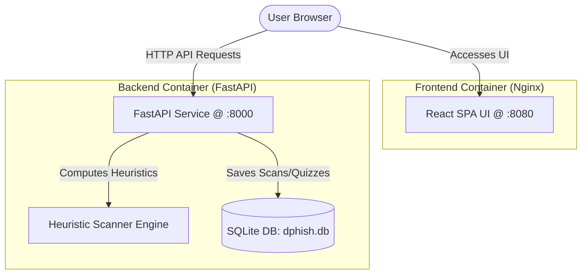

# DPhish — Cyber Threat & Phishing Intelligence Platform

DPhish is a secure awareness training platform and threat heuristics analyzer. It provides a beautiful interface (Security Dashboard) containing telemetry charts, a real-time email heuristics threat analyzer, phishing quizzes, and educational resources. 

The application is split into a **Python FastAPI backend** and a **React (Vite + TypeScript) frontend**, fully containerized using Docker and orchestrated using Docker Compose.

---

## 🏗️ Architecture & Stack



### Key Technologies
*   **Frontend**: React 18, Vite, TypeScript, Nginx (for production container runtime).
*   **Backend**: Python 3.11, FastAPI, SQLAlchemy, SQLite (for zero-configuration database storage).
*   **Deployment**: Multi-stage Docker builds, Docker Compose.

---

## 📂 Project Structure

```text
Dphish/
├── docker-compose.yml          # Root multi-container composer layout
├── README.md                   # Core project documentation (this file)
├── backend/                    # Python FastAPI Backend
│   ├── app/                    # Application source code
│   │   ├── database.py         # DB connection & Session builder
│   │   ├── models.py           # SQLAlchemy schemas (ScanHistory, QuizResult)
│   │   ├── schemas.py          # Pydantic data validation contracts
│   │   ├── heuristics.py       # Phishing email heuristics rules engine
│   │   ├── crud.py             # Database CRUD helper functions
│   │   └── main.py             # FastAPI entrypoint, routes, startup pre-seed
│   ├── Dockerfile              # Multi-stage python-slim runtime builder
│   └── requirements.txt        # Backend dependencies
└── task1_react_app/            # React Vite Frontend
    ├── src/                    # React components and code
    │   ├── components/         # UI Components (Dashboard, Analyzer, Quiz)
    │   ├── utils/              # Security scan engine (fallback rules)
    │   ├── App.tsx             # Main layout, routing, API synchronizers
    │   └── main.tsx            # DOM mounting entrypoint
    ├── Dockerfile              # Production multi-stage Nginx builder
    ├── nginx.conf              # SPA-compliant Nginx routing reverse proxy
    └── package.json            # NPM scripts & dependencies
```

---

## 🚀 Getting Started (Docker Compose)

The easiest way to run the entire stack is using Docker Compose.

### 1. Build and Start the Application
Run the following command from the root directory:
```bash
docker compose up -d --build
```

### 2. Access the Services
Once compilation completes and the containers are healthy, open your web browser:
*   **Web Application (UI)**: [http://localhost:8080](http://localhost:8080)
*   **Interactive API Docs (Swagger UI)**: [http://localhost:8000/docs](http://localhost:8000/docs)

### 3. Tear Down Containers
To stop the services and release ports:
```bash
docker compose down
```

---

## 🛠️ Local Development (Running Manually)

If you wish to run the frontend and backend separately without containers for development purposes:

### Prerequisites
*   Node.js (v20+ recommended)
*   Python (v3.10+ recommended)

### 1. Run Backend Locally
Navigate to the `/backend` folder:
```bash
cd backend

# Create virtual environment
python3 -m venv venv
source venv/bin/activate  # On Windows: venv\Scripts\activate

# Install dependencies
pip install -r requirements.txt

# Run the dev server
uvicorn app.main:app --reload --host 0.0.0.0 --port 8000
```

### 2. Run Frontend Locally
Navigate to the `/task1_react_app` folder in a new terminal window:
```bash
cd task1_react_app

# Install package dependencies
npm install

# Run the dev server
npm run dev
```
The frontend dev server will launch at [http://localhost:5173](http://localhost:5173).

---

## 🛡️ Telemetry & Heuristics Features

### Heuristics Rules (Python & TS fallback)
1.  **URL Checks**: Scans content for links. Deducts points and highlights warnings if links use insecure `http://` schemes, contain suspicious spoof words (e.g., `verify-paypal`), contain direct IP addresses as hosts, or use complex structures.
2.  **Pressure Indicators**: Deducts points for urgent text commands (e.g., `immediate action required`, `account suspended`).
3.  **Generic Greetings**: Identifies templates addressing customers generally rather than personally.
4.  **Financial Requests**: Flags transfers, gift card solicitations, bitcoin requests, etc.

### Telemetry Dashboard
The dashboard queries backend stats dynamically to:
*   Update the **Security Gauge** using historical scan averages.
*   Update the **Telemetry KPIs** (Item scan counts, threat counts).
*   Render a **100% dynamic sparkline chart** plotting the trajectory of latest scan activities.
